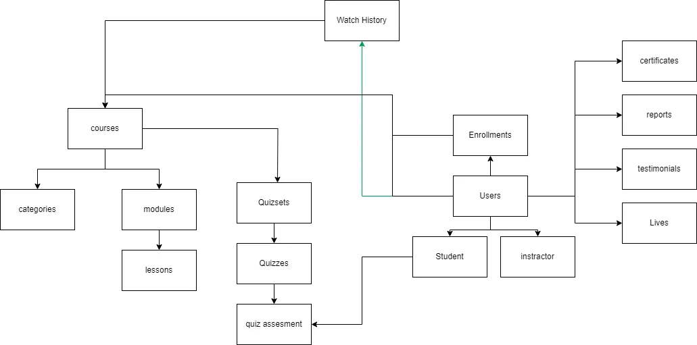

# EduConnect

## diagram
diagrams folder contains the diagram of the project in the form of a .drawio file. The diagram is also exported as a .webp file.

## Feature

- [] Show all course
- [] Show all categories

